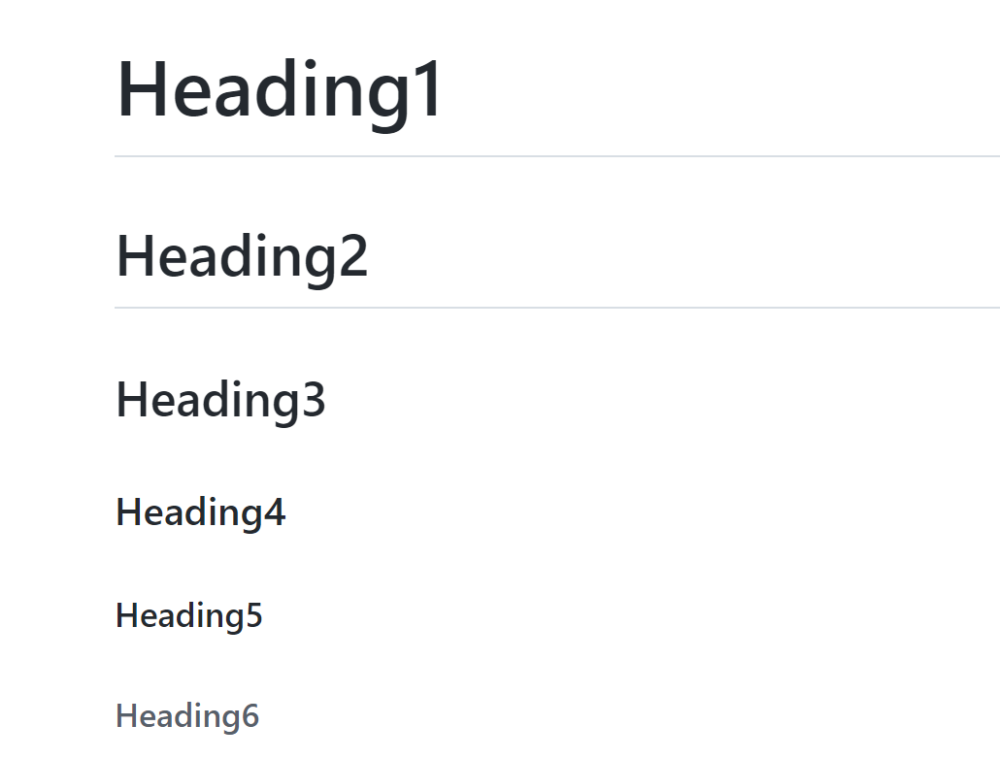

# html
- changing title displayed in browser tab `<title>Hasan's Website</title>`
- changing background color `<body style="background-color: aquamarine;">`
- adding image ``
- changing size of image `` 
- HTML has 6 headings `<h1>Heading1</h1>` `<h2>Heading2</h2>` `<h3>Heading3</h3>` `<h4>Heading4</h4>` `<h5>Heading5</h5>` `<h6>Heading6</h6>`

- changing font `<h1 style = "font-family: courier">Change Font</h1>`
